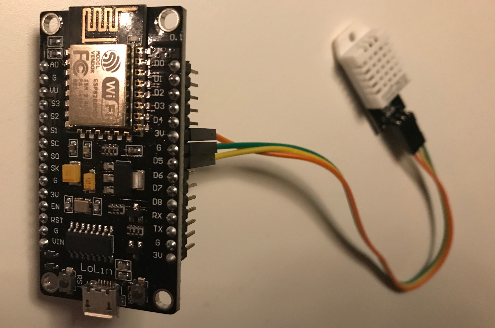

# Temp Sensor

This is a summary of my microcontrol project. The actual hardware is a esp 8266 NodeMCU microcontrol running micropython with a DHT22 sensor connected to it. Once its setup the microcontrol will publish temperature and humidity to a MQTT broker.

This project is suitable to run on a Raspberry Pi and is intended to use with [Home Monitor](http://github.com/johanlundahl/home_monitor), [Home Store](http://github.com/johanlundahl/home_store), [Home Eye](http://github.com/johanlundahl/home_eye) and [Mosquitto MQTT Broker](https://randomnerdtutorials.com/how-to-install-mosquitto-broker-on-raspberry-pi/).



<!-- Tutorial used: http://docs.micropython.org/en/latest/esp8266/quickref.html -->

## Wire the thing
Connect the DHT22 sensor to the ESP8266 according to:
* the `VCC` pin (marked `+`) connects to a `3V` pin on the microcontrol 
* the `DATA` pin (marked `Out`) connects to the `D5` pin (i.e. `GPIO14`) on the microcontrol
* the `GND` pin (marked `-`) connects to a `G` pin on the microcontrol

If the microcontrol shall be powered by battery then the `Do` pin (i.e. `GPIO16`) needs to connect to the `RST` pin so that the microcontrol can wakt itself up. See this [blog post](
https://randomnerdtutorials.com/micropython-esp8266-deep-sleep-wake-up-sources/) for more information.

## Installation

Download micropython distribution for the esp8266 board at http://micropython.org/download#esp8266.

Esptool will be used to load micropython to the esp8266. Install esptool with
```
$ pip install esptool
```

Connect the esp8266 with USB. Erase the flash using the following command
```
$ python3 esptool.py --port /dev/tty.usbserial-1410 erase_flash
```
<!-- /Library/Frameworks/Python.framework/Versions/3.6/lib/python3.6/site-packages/esptool.py -->

Deploy the new firmware using
```
$ python3 esptool.py --port /dev/tty.usbserial-1410 --baud 460800 write_flash --flash_size=detect 0 esp8266-20190125-v1.10.bin 
```

Clone this git repo

```
$ git clone https://github.com/johanlundahl/home_monitor
```

Make sure to specify the correct values in the config.py file so that the microcontrol will connect to the correct wifi and publish to right broker.

Upload the following files to the microcontrol:
* temp_sensor/boot.py
* temp_sensor/config.py
* temp_sensor/main.py
* temp_sensor/sensor.py
* temp_sensor/umqttsimple.


Edit the `temp_sensor/config.py` to set the following configuration parameters:
```
wifi_name = 'wifi-ssid-name'
wifi_password = 'wifi-password'
mqtt_server = 'ip-address-of-mqtt-broker'
topic_pub = b'mqtt-topic-name'
message_retry = 60			# seconds to wait between publish failures
deep_sleep_interval	= 60	# seconds to set device in deep sleep
sensor_name = 'name-of-the-sensor'
```

## Start the microcontrol
Once the microcontrol is powered up it will start automatically and publish values to the configured MQTT broker at the given interval.

## NodeMCU Howto

### Connect to the esp8266

Connect to the esp8266 running micropython through the terminal using
```
$ screen /dev/tty.usbserial-1410 115200
```

Once you want to end your termminal session simply exit by entering
```
Ctrl-a then k then y 
```

### Microcontrol wifi AP
A fresh install of MicroPython has a wifi AP. Read the following to figure out the IP of the microcontrol and how to connect to it http://docs.micropython.org/en/latest/esp8266/tutorial/intro.html#wifi

### Get IP of microcontrol
The IP of the microcontrol is needed when uploading files to the microcontrol. Log on to the microcontrol and enter the following from the command line:
```
>>> import network
>>> station = network.WLAN(network.STA_IF)
>>> print(station.ifconfig())
```

### Download and upload of files
Use the Web REPL to download and upload files to the esp8266 device. Start by enabling Web REPL on the device by entering the following command and follow the instructions:
```
$ import webrepl_setup
```

Clone Git repo https://github.com/micropython/webrepl to your computer or use the online web UI at http://micropython.org/webrepl/. This will enable you to download and upload files to the device.


To upload a file throught the command line using webrepl:
```
$ python3 webrepl_cli.py local-file-to-upload.py target-ip:uploaded-file-name.py
```

Upload all of the .py files from this repository to the microcontrol.

